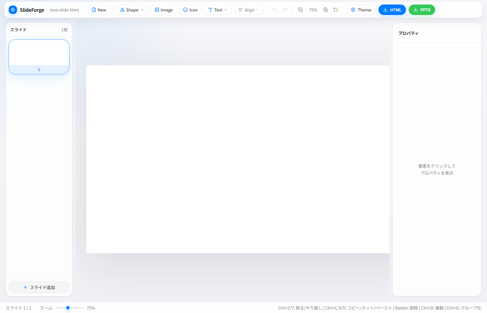

# SlideForge

A visual HTML slide editor built with Next.js. Drop in an HTML presentation file and edit slides with a WYSIWYG interface — then export back to HTML or PPTX.




## Features

- **Drag & drop** HTML files to start editing
- **Visual slide editor** with live iframe preview
- **Insert elements** — shapes, text, images, icons
- **Property panel** — edit CSS styles, position, size directly
- **Multi-select & align** elements across the slide
- **Undo / Redo** with full history (Ctrl+Z / Ctrl+Y)
- **Copy / Paste / Duplicate** elements (Ctrl+C/V/D)
- **Group / Ungroup** elements (Ctrl+G / Ctrl+Shift+G)
- **Slide management** — add, duplicate, delete, reorder
- **CSS variable theming** — edit design tokens globally
- **Export to HTML** — preserves all edits
- **Export to PPTX** — AI-powered conversion via Claude CLI
- **Cloud save** (optional) — save/load projects via Google Apps Script

## Getting Started

```bash
npm install
npm run dev
```

Open [http://localhost:3010](http://localhost:3010).

## Keyboard Shortcuts

| Shortcut | Action |
|----------|--------|
| Ctrl+Z | Undo |
| Ctrl+Y / Ctrl+Shift+Z | Redo |
| Ctrl+C | Copy |
| Ctrl+X | Cut |
| Ctrl+V | Paste |
| Ctrl+D | Duplicate element |
| Ctrl+G | Group selected |
| Ctrl+Shift+G | Ungroup |
| Delete / Backspace | Delete element |

## Environment Variables (Optional)

| Variable | Description |
|----------|-------------|
| `NEXT_PUBLIC_GAS_SLIDE_API` | Google Apps Script deployment URL for cloud save/load |
| `CLAUDE_BIN_PATH` | Path to Claude CLI binary (for PPTX export) |
| `GIT_BASH_PATH` | Path to Git Bash (Windows, for PPTX export) |

## Tech Stack

- **Next.js 14** (App Router)
- **Zustand** for state management
- **Tailwind CSS** for styling
- **Lucide React** for icons
- **pptxgenjs** for PowerPoint export

## License

MIT
